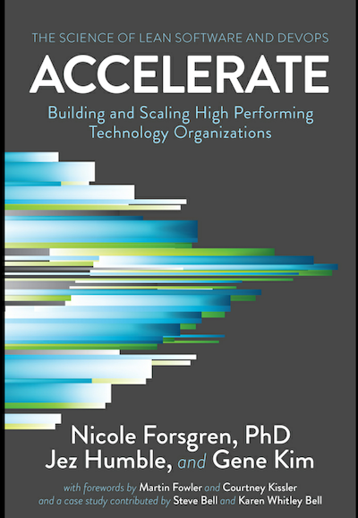

# Metrics

The goals is to gather key metrics from Github PRs.

This is in relation to the Accelerate book



## Deployment Frequency

This will assume a CI system that takes the main branches successful merge to staging

## Lead Time for Change

"the time it takes to go from code committed to code successfully running in production”

This one is more tricky. We will come back to this later. But for now we will have certain data in hand

- created_at
- merged_at
- merge_commit_sha - this we can use to find if it has been deployed

## MTTR

Using the numbers above we then look for labels

- critical
- mttr
- hotfix

## Change Failure Rate

Using the MTTR we can then tie the `merge_commit_sha` to a previous SHA and therefore related deployment.
Then we can figure out total deployments vs these related items

## Setup

```
pip3 install -r requirements.txt
cp .env.example .env
```

Then get a github token that can read the PR history

## Running Script

The below example uses a repo with pull requests.

```
python3 repo_report.py --help

almac@Macintosh metrics % python3 repo_report.py --help
Usage: repo_report.py [OPTIONS]

Options:
  --owner_repo TEXT  use foo/bar as the input make sure you have pull
                     requests

  --format TEXT      Output as csv or json
  --help             Show this message and exit.
```

A good example is

```
python3 repo_report.py --owner_repo friendsofcat/laravel-feature-flag
```
